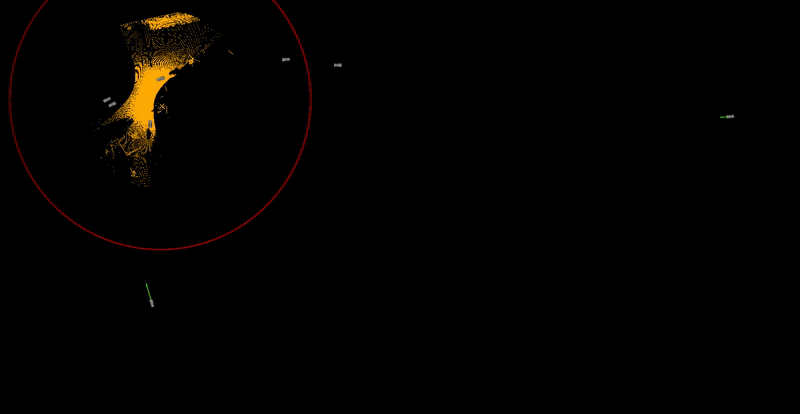
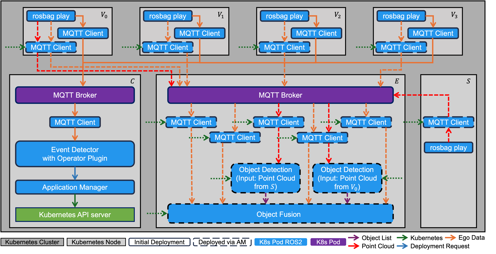

# Collective Perception at Intersection

## Content
- [Use Case Description](#use-case-description)
- [Folder Structure](#folder-structure)
- [Usage](#usage)
  - [Prerequisites](#prerequisites)
  - [Quick Start](#quick-start)
  - [Advanced Monitoring](#advanced-monitoring)
  - [Interaction and Configuration](#interaction-and-configuration)

## Use Case Description
The use case involves a roadside infrastructure station unit (RISU) located at an intersection. Connected vehicles approach the intersection with a time shift. Collective perception is performed if at least one connected vehicle is in proximity to the RISU. The *Object Detection Fusion* application enabling collective perception is executed on an edge server. The vehicles publish [EgoData](https://github.com/ika-rwth-aachen/perception_interfaces/blob/main/perception_msgs/msg/EgoData.msg) containing their poses. One of the vehicles additionally publishes point clouds obtained via lidar sensors. The RISU is equipped with a lidar sensor and also publishes point clouds.

The *Object Detection Fusion* application involves multiple microservices: It involves one *Object Detection* microservice per received point cloud topic computing and publishing [ObjectLists](https://github.com/ika-rwth-aachen/perception_interfaces/blob/main/perception_msgs/msg/ObjectList.msg). Additionally, it involves one *Object Fusion* microservice that subscribes to the [ObjectLists](https://github.com/ika-rwth-aachen/perception_interfaces/blob/main/perception_msgs/msg/ObjectList.msg) published by the *Object Detections* and [EgoData](https://github.com/ika-rwth-aachen/perception_interfaces/blob/main/perception_msgs/msg/EgoData.msg) published by the vehicles. The *Object Fusion* fuses [ObjectLists](https://github.com/ika-rwth-aachen/perception_interfaces/blob/main/perception_msgs/msg/ObjectList.msg) and [EgoData](https://github.com/ika-rwth-aachen/perception_interfaces/blob/main/perception_msgs/msg/EgoData.msg) into a single [ObjectList](https://github.com/ika-rwth-aachen/perception_interfaces/blob/main/perception_msgs/msg/ObjectList.msg).

The *operator application* composed of Application Manager and Event Detector with Operator Plugin is responsible for the deployment of the *Object Detection Fusion* application. The Event Detector with Operator Plugin detects the proximity of vehicles to the RISU. If at least one vehicle is in proximity to the RISU, the Event Detector requests the deployment of the *Object Detection Fusion* application. The Application Manager deploys the *Object Detection Fusion* application on the edge server.

<p align="center">
  
</p>

The video shows a section of the data upon which the use case is built. Poses of the connected vehicles are visualized as green arrows. The point clouds can be seen in blue and orange. The playback is sped up tenfold. The region of interest for deploying the application for collective perception is illustrated as a red circle.

<p align="center">

</p>

The image illustrates the Kubernetes cluster with all nodes and involved microservices deployed in Kubernetes pods. It is visualized which microservices are initially deployed and which are deployed on demand by the Application Manager.

> [!TIP]
> Check out the [application manager repository](https://github.com/ika-rwth-aachen/application_manager) containing the reference implementation of our Application Management Framework.
> The reference implementation supports the application *Object Detection Fusion* which is used in this use case. It is extensible for further applications.

## Folder Structure
```bash
robotkube
└── use-cases
    └── collective-perception-intersection
        ├── assets
        ├── data
        │   └── machine-id
        └── kubernetes
            ├── application_manager
            ├── application_registry_interface
            ├── initial_deployment
            ├── mosquitto_config
            ├── operator_config
            ├── roles
            ├── ros_paramsfiles
            ├── templates
            └── volumes
```

## Usage

### Prerequisites

If not available already, install the following:

- [Ubuntu](https://ubuntu.com/download/desktop)
- [Docker Engine](https://docs.docker.com/engine/install/ubuntu/) 
- [k3d](https://k3d.io/v5.6.0/#install-current-latest-release)
- [kubectl](https://kubernetes.io/docs/tasks/tools/#kubectl)
- [Helm](https://helm.sh/docs/intro/install/)
- Python Package [PyYAML](https://pypi.org/project/PyYAML/)


We recommend *200 GB* of free disk space.

#### Increase Limits for inotify
The following commands increase the limits for inotify instances and watches, which are used by Linux for file system event notifications. This is necessary when working with multiple Kubernetes nodes, as many processes may need to monitor file changes, and the default limits can quickly be exhausted, leading to errors.
```bash
sudo sysctl fs.inotify.max_user_watches=1048576
sudo sysctl fs.inotify.max_user_instances=512
```

### Quick Start

1. Make sure prerequisites are installed and clone this repository:

    ```bash
    git clone --recurse-submodules https://github.com/ika-rwth-aachen/robotkube.git
    ```

    - If you have already cloned without the `--recurse-submodules` flag, you can initialize all submodules by running:
        ```bash
        git submodule update --init --recursive
        ```

1. Create a [local k3d image registry](https://k3d.io/v5.2.0/usage/registries/) using the provided bash script:
    ```bash
    # robotkube/use-cases/collective-perception-intersection
    ./createRegistry.sh
    ```

    **Hint**: This will take approximately 5 minutes.
1. Run the provided helper script [createCluster.sh](./createCluster.sh) to create the Kubernetes Cluster:
    ```bash
    # robotkube/use-cases/collective-perception-intersection
    ./createCluster.sh
    ```

    **Hint**: This will take approximately 5 minutes. Previous clusters named `robotkube` will be deleted.

1. Monitor the start-up and shut down of the different Kubernetes resources and also the (un)installation of Helm releases:
    ```bash
    watch -n 0.1 kubectl get all
    ```
    ```bash
    watch -n 0.1 helm list
    ```

1. In a new terminal, run the provided helper script [start.sh](./start.sh) to trigger the initial deployment:
    ```bash
    # robotkube/use-cases/collective-perception-intersection
    ./start.sh
    ```
    This script will reset and reconfigure the cluster every time it is run. 

    You can now monitor the different Kubernetes resources in the first terminal. An initial deployment will be started. After a while, you can see the automatic deployment of the recording application, as described in the paper.

1. If you want to stop the Kubernetes ressources and uninstall the Helm releases, run
    ```bash
    # robotkube/use-cases/collective-perception-intersection
    ./stop.sh
    ```

1. If you want to delete the k3d cluster, run
    ```bash
    k3d cluster delete robotkube
    ```

### Advanced Monitoring
If you want to receive more information on what is happening in the cluster and to evaluate the capabilities of the Application Management Framework, like bookkeeping and dynamic reconfiguration, you can execute the following commands:
1. Monitor the distances between the connected vehicles and the RISU and observe the event detector sending deployment requests:
    ```bash
    kubectl logs -f deployment/cloud-event-detector-operator
    ```
1. Observe the dynamic reconfiguration of the *Object Detection Fusion* application. When the first vehicle approaches the RISU, the application is deployed. When further vehicles approach the RISU, the application is dynamically reconfigured to subscribe to the topics of the new vehicles. The application is reconfigured without downtime. The following command shows the current information on the ROS 2 node of the object fusion. Monitor the list of subscribed topics which changes with the arrival of new vehicles:
    ```bash
    watch -n 0.1 'kubectl exec -it deployment/of-edge-object-detection-fusion-deployment -- bash -c "source install/setup.bash && ros2 node info /of_edge_object_detection_fusion"'
    ```
1. Monitor the current status of the bookkeeping achieved with the Application Management Framework. With the following commands, you can observe the current set of requesters requesting the specific services. The set of requesters changes with each vehicle approaching the RISU. For the object fusion, the requesters are listed per input topic per topic type which is either `EgoData` or `ObjectList`.
    ```bash
    watch -n 0.1 docker exec -it k3d-robotkube-server-0 cat /bookkeeping/mqtt/mqtt_bookkeeping.yml
    watch -n 0.1 docker exec -it k3d-robotkube-server-0 cat /bookkeeping/object-fusion/object_fusion_bookkeeping.yml
    watch -n 0.1 docker exec -it k3d-robotkube-server-0 cat /bookkeeping/object-detection/object_detection_bookkeeping.yml
    ```

### Interaction and Configuration

If you want to interact with the applications in the cluster or configure them differently, you have the following options:

1. Attach to one of the containers/pods in the cluster:
    ```bash
    kubectl exec -it <POD_NAME> -- bash
    ```
    Replace `POD_NAME` with the desired pod's name. To get a list of all available pod names, run
    
    ```bash
    kubectl get pods --no-headers -o custom-columns=":metadata.name"
    ```

2. You may change the [parameters](kubernetes/ros_paramsfiles/event_detector_operator.params.yml) for the Event Detector detecting the proximity between the vehicles and the RISU. These changes will be applied automatically when you run [start.sh](./start.sh) again:

    ```bash
    # robotkube/use-cases/collective-perception-intersection
    ./start.sh
    ```
