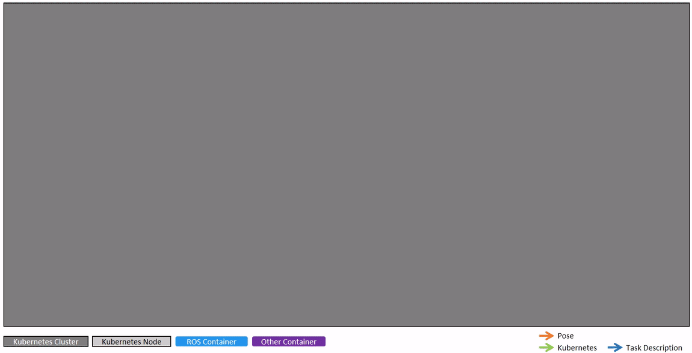

# Pose Point Cloud DB Recording

## Content
- [Use Case Description](#use-case-description)
- [Folder Structure](#folder-structure)
- [Usage](#usage)
  - [Prerequisites](#prerequisites)
  - [Quick Start](#quick-start)
  - [Advanced Monitoring](#advanced-monitoring)
  - [Interaction and Configuration](#interaction-and-configuration)

## Use Case Description

The use case involves fifteen connected vehicles, two of which are equipped with a lidar sensor. All vehicles send their poses to a cloud. When the lidar-equipped vehicles are near each other, the deployment of additional applications in the Kubernetes cluster is automatically triggered such that the two lidar-equipped vehicles start to additionally transmit their lidar point clouds to the cloud where they are stored in a database, along with the corresponding poses, e.g., allowing [collective learning](https://doi.org/10.1007/s38314-022-1405-9).

<p align="center">
  
</p>

The video shows a section of the data upon which the use case is built. Poses of vehicles with no lidar sensor are visualized as green arrows. Poses of lidar-equipped vehicles are visualized as red arrows. The point clouds can be seen in blue and orange. The playback is sped up eightfold.

<p align="center">

</p>

The animation shows how the different software components interact during the exemplary use case. Some initially deployed services are continually running. Upon the detection of proximity between the lidar-equipped vehicles, additional services are deployed to enable the transfer of poses and point clouds from the vehicles to a database in the cloud. When the proximity ends, the additional services are automatically removed again. 

This approach can be adjusted to various other use cases where additonal software shall be deployed or scenario data shall be recorded when triggered by an event.

## Folder Structure

```
robotkube
└── use-cases
    └── pose-point-cloud-db-recording
        ├── assets                 # teaser video of use case  
        ├── data                   # use case data will be stored here
        |     ├── db               # database with poses and point cloud metadata
        |     └── large_data       # point clouds
        └── kubernetes             # kubernetes related files
            ├── initial_deployment              # initial deployment resource definitions
            ├── ros_launchfiles                 # initial deployment ros launch files 
            ├── ros_paramsfiles                 # initial deployment ros parameter files 
            ├── templates                       # templates for initial deployment resource definitions
            └── volumes                         # persistent volumes and claims
```

## Usage
### Prerequisites

If not available already, install the following:

- [Ubuntu](https://ubuntu.com/download/desktop)
- [Docker Engine](https://docs.docker.com/engine/install/ubuntu/) 
- [K3D](https://k3d.io/v5.6.0/#install-current-latest-release)
- [kubectl](https://kubernetes.io/docs/tasks/tools/#kubectl)
- [Helm](https://helm.sh/docs/intro/install/)
- Python Package [PyYAML](https://pypi.org/project/PyYAML/)


We recommend *400 GB* of free disk space.

#### Increase Limits for inotify
The following commands increase the limits for inotify instances and watches, which are used by Linux for file system event notifications. This is necessary when working with multiple Kubernetes nodes, as many processes may need to monitor file changes, and the default limits can quickly be exhausted, leading to errors.
```bash
sudo sysctl fs.inotify.max_user_watches=1048576
sudo sysctl fs.inotify.max_user_instances=512
```

### Quick Start

1. Make sure prerequisites are installed and clone this repository:

    ```bash
    git clone https://github.com/ika-rwth-aachen/robotkube.git
    ```

1. Create a [local k3d image registry](https://k3d.io/v5.2.0/usage/registries/) using the provided bash script:
    ```bash
    # robotkube/use-cases/pose-point-cloud-db-recording
    ./createRegistry.sh
    ```

    **Hint**: This will take approximately 10 minutes.
1. Run the provided helper script [createCluster.sh](./createCluster.sh) to create the Kubernetes Cluster
    ```bash
    # robotkube/use-cases/pose-point-cloud-db-recording
    ./createCluster.sh
    ```

    **Hint**: This will take approximately 20 minutes. Previous clusters named `robotkube` will be deleted.

1. Monitor the start-up and shut down of the different Kubernetes resources and also the (un)installation of Helm releases
    ```bash
    watch -n 0.1 kubectl get all
    ```
    ```bash
    watch -n 0.1 helm list
    ```

1. In a new terminal, run the provided helper script [start.sh](./start.sh) to trigger the initial deployment.
    ```bash
    # robotkube/use-cases/pose-point-cloud-db-recording
    ./start.sh
    ```
    This script will reset and reconfigure the cluster every time it is run. 

    You can now monitor the different Kubernetes resources in the first terminal. An initial deployment will be started. After a while, you can see the automatic deployment of the recording application, as described in the paper.

    In [data/db](./data/db), you find the mongoDB database. It stores recorded poses and paths to corresponding point clouds which are stored in [data/large_data](data/large_data/).

1. If you want to stop the Kubernetes ressources and uninstall the Helm releases, run
    ```bash
    # robotkube/use-cases/pose-point-cloud-db-recording
    ./stop.sh
    ```

1. If you want to delete the K3D cluster, run
    ```bash
    k3d cluster delete robotkube
    ```

### Advanced Monitoring

If you want to receive more information on what is happening in the cluster, you have the following options:

1. Monitor the current lidar-equipped vehicles' distance to each other
    ```bash
    kubectl logs --follow $(kubectl get pods | grep cloud-operator | awk '{print $1}') | grep "Distance between clients"
    ```

2. Monitor the time it takes to analyze the distances between all vehicles.
    ```bash
    kubectl logs --follow $(kubectl get pods | grep cloud-operator | awk '{print $1}') | grep "Analyzed rule"

3. Visualize the content of the database using [mongo-express](https://github.com/mongo-express/mongo-express) by running 
    ```bash
    # robotkube/use-cases/pose-point-cloud-db-recording
    docker compose -f data/docker-compose.yml up
    ```
    and then opening [http://localhost:8081](http://localhost:8081) in your browser (user: `admin`, password: `pass`). Here, choose the `mongodb` database to get the following view:

    

    You may take a look at the content of each collection.

    *Hint*: The deployments in the cluster must be stopped in order for the database visualization to work and you must have gathered data before.

### Interaction and Configuration

If you want to interact with the applications in the cluster or configure them differently, you have the following options:

1. Attach to one of the containers/pods in the cluster:
    ```bash
    kubectl exec -it <POD_NAME> -- bash
    ```
    Replace `POD_NAME` with the desired pod's name. To get a list of all available pod names, run
    
    ```bash
    kubectl get pods --no-headers -o custom-columns=":metadata.name"
    ```

2. You may change the [parameters](kubernetes/ros_paramsfiles/event_detector_operator.params.yaml) for the proximity event detector after you have created the cluster using `createCluster.sh`. These changes will be applied automatically when you run [start.sh](./start.sh) again

    ```bash
    # robotkube/use-cases/pose-point-cloud-db-recording
    ./start.sh
    ```
